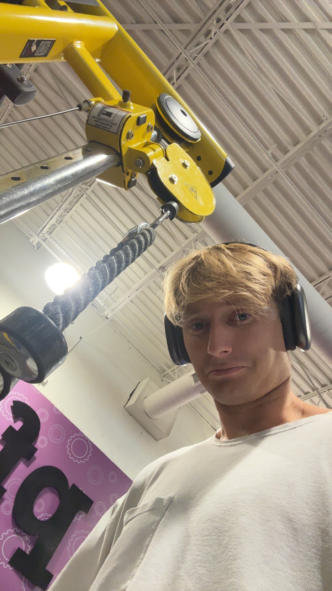

### I FINISHED MY FIRST YEAR OF GRAD SCHOOL 🦍

Shittt time has really flown, it's already June. I'm currently working at INB as a IT/dev intern, where I'm building a pretty exciting project: an IT chatbot that acts as the first level of support for company employees. It’s been a fun and interesting experience so far!

Today marks **Day 142** of my Programming Everyday series on YouTube. I can't believe I'm nearly five months into this journey. I'm proud of the progress I've made, especially in competitive programming. Today also happens to be my first-ever livestream on YouTube, I'm curious to see how it goes by my next update. I'm excited to see how this goes!

Looking ahead, I'm really looking forward to graduating this December and stepping into my first full-time role as a swe, something I've been working toward for years. See you at the end of the year!

---

### Next Half 🚀

For the second half of the year, one of my big goals is to reach **500** subscribers on my YouTube channel, currently sitting at 200! I'm excited to see how far I can take this by the end of the year.

I'm going to keep working hard, having fun and enjoying life as it goes. There's some big changes coming my way in the next 6 months and I am excited to see where I end up. I could anywhere, the possibilities are endless.

Ohh forgot to mention, I have started my fitness journey. (I'm currently about nearly three weeks in). Excited to see the progress I make by the end of the year! See you all again at the end of the year!

*Big time gym pic here*