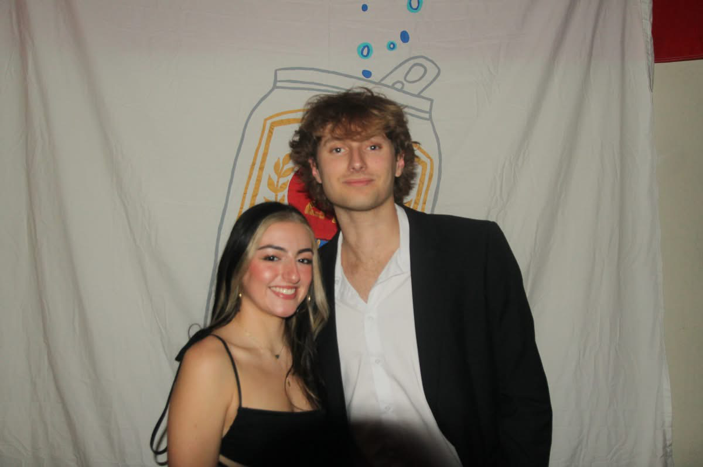

# A Year in Review, My 2024

---

### I GRADUATED: A Milestone Achieved 🎓

This year, I proudly graduated from **Eastern Illinois University** with a **Bachelor of Computer Science**, along with minors in Mathematics and Business Administration. My time as a student was incredible—I played Division 1 Tennis for five years, served as the president of my fraternity in my final year, and started dating the love of my life in January 2024 (nearly one year!). I’m incredibly grateful for the people I met along the way and the challenges that shaped me. And of course, the fun at college, maybe a bit too much... But hey, that's me, always down for a good time.

If you had asked me about getting involved as a freshman, I would have said absolutely not. College taught me how to come out of my shell, make friends, and network. Man... Before college, I sat at a computer 24/7 and only went outside to play tennis. Guess things have changed now—enjoying life and meeting people. I'm always open to chat about my college experience, hit me up anytime. JEVO BABY!

Reflecting on all these experiences, I am sad to be moving on from Eastern Illinois—a chapter of my life I will never forget and will always hold dear. However, as they all say, one door closes and another one opens. Cheers to that 🥂

---

### From Bachelors to Masters: A New Degree 🌟

With my Bachelor's Degree in hand, a new journey awaits— just another piece of paper! I've joined the **University of Illinois Springfield (UIS)** as a graduate student. Just joking, it’s not just another piece of paper! I want to continue my education as a graduate student, might as well do it while I'm young. Already wrapped up my first semester though, only two more to go. I'm definitely learning new skills that I never would have touched in a traditional computer science undergraduate program.

Springfield, as a city, it's okay. The food is absolutely amazing though—a big upgrade from Chubby's Pizza and McDonald's back in Charleston, IL. Springfield has everything, dude—any sort of food you can think of, it's here. I also moved here with my buddy from my fraternity—entrepreneurial type shit. No, just joking, maybe in the future though 😏

My passion for creating things has only grown stronger. Since moving, I have focused much more on my career, diving into new topics and learning different subjects to grow as a **software engineer**.

---

### The Path Ahead 🚀

Finally, looking at the path ahead: 2025, geez. I turn 24 this year, that feels old... Regardless, I am dedicating this year to career growth. Learning as much as possible, posting videos of my journey, and documenting it on this website each month.

I’m looking forward to continuing my degree work, serving as a teaching assistant at the university, updating this website frequently, and adding new features. Also, I'm working on enhancing my technical skills on my social media platforms, and continuing work on my personal project, AlumLinx, with some close friends. Cheers to 2025 🥂

*Me and my love. Ignore the hair ik, it's crazy. That's the college life*